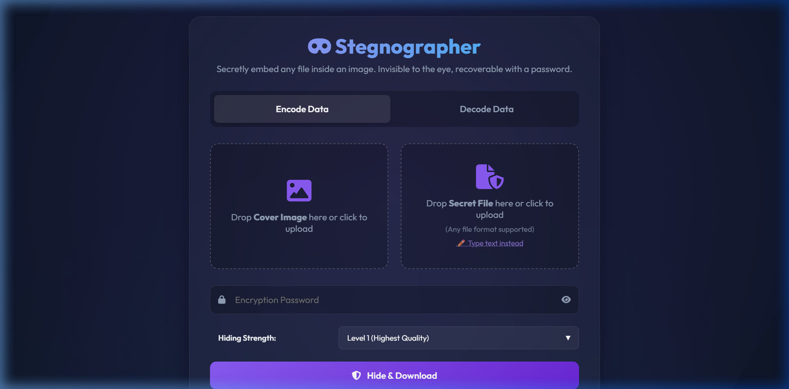
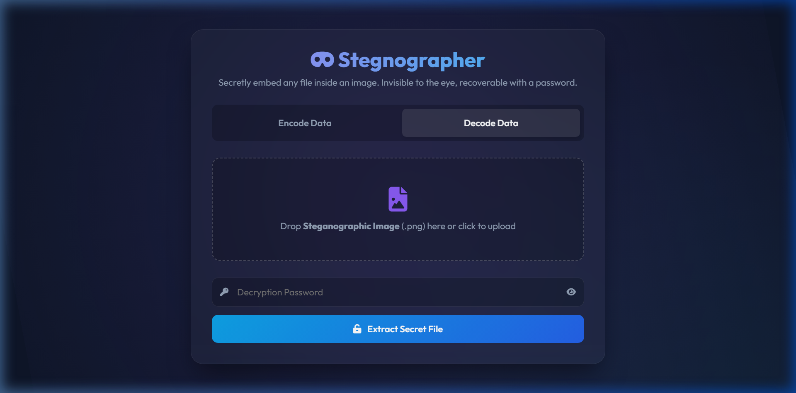

# 🎭 Stegnographer - Image Steganography Tool



**Stegnographer** is a web application designed for secure, invisible data concealment within images. Built with a Python backend and a modern frontend, it allows you to hide any file—from text to archives—inside a standard PNG image without any visible change to the naked eye.

> [!IMPORTANT]
> This project uses a **Knight's Tour** traversal algorithm combined with **LSB Encoding** to ensure your data is scattered unpredictably across the image, making it resistant to simple sequential analysis.

---

## ✨ Key Features

- **🏰 Knight's Tour Scattering**: Instead of hiding data linearly, Stegnographer uses a randomized Warnsdorff's Knight's Tour on 8x8 blocks. The sequence is seeded by your password, meaning only the correct key can reconstruct the path.
- **💎 Adjustable Hiding Strength**: Choose between Level 1 (1-bit, highest quality), Level 2 (2-bit), or Level 3 (3-bit, max capacity) depth.
- **📦 Smart Compression**: Automatically applies `zlib` compression to minimize the footprint of your secret data.
- **📊 Real-time Diagnostics**: View instant capacity estimates, pixel counts, and PSNR (Peak Signal-to-Noise Ratio) quality metrics before you encode.
- **🌑 Premium Glassmorphism UI**: A sleek, dark-themed interface with smooth animations and intuitive drag-and-drop support.
- **🛡️ Secure Retrieval**: Built-in password verification and data integrity checks ensure your files are recovered perfectly or not at all.

---

## 🛠️ Technology Stack

| Component | Technology |
| :--- | :--- |
| **Backend** | Python / Flask |
| **Image Processing** | Pillow (PIL) / NumPy |
| **Frontend** | HTML5 / CSS3 / Vanilla JavaScript |
| **Icons & Fonts** | Font Awesome / Google Fonts (Outfit) |
| **Compression** | Zlib |

---

## 🚀 Getting Started

### Prerequisites

- Python 3.8 or higher
- `pip` package manager

### Installation

1. **Clone the repository**:
   ```bash
   git clone https://github.com/your-username/stegnographer.git
   cd stegnographer
   ```

2. **Install dependencies**:
   ```bash
   pip install -r requirements.txt
   ```

3. **Run the application**:
   ```bash
   python app.py
   ```

4. **Access the Studio**:
   Open your browser and navigate to `http://127.0.0.1:5000`.

---

## 📖 How it Works

1. **Password Hashing**: Your password is hashed using SHA-256 to create a secure integer seed.
2. **Path Generation**: This seed determines the shuffle order of 8x8 pixel blocks and the starting point of the Knight's Tour within each block.
3. **Bit Manipulation**: The secret data (compressed) is injected into the Least Significant Bits (LSB) of the RGB channels according to the generated path.
4. **Indistinguishable**: The resulting PNG is visually identical to the original, as the changes occur at a level the human eye cannot perceive.

---

## 🎨 UI Preview

### Encode & Decode Interfaces
<p align="center">
  
  
</p>

The interface is designed for professionals, featuring:
- **Dynamic Stats Panel**: Updates as you select files to show if they fit.
- **Progress Tracking**: Real-time feedback for long-running encoding/decoding tasks.
- **Embedded Text Editor**: Quickly hide text messages without needing to upload a separate `.txt` file.

---

> [!TIP]
> For maximum security, use a high-resolution cover image and a complex password. High-resolution images provide more "noise" space, making the hidden bits even harder to detect statistically (Steganalysis).

---
*Created for College Subject Projects - Digital Image Processing.*
